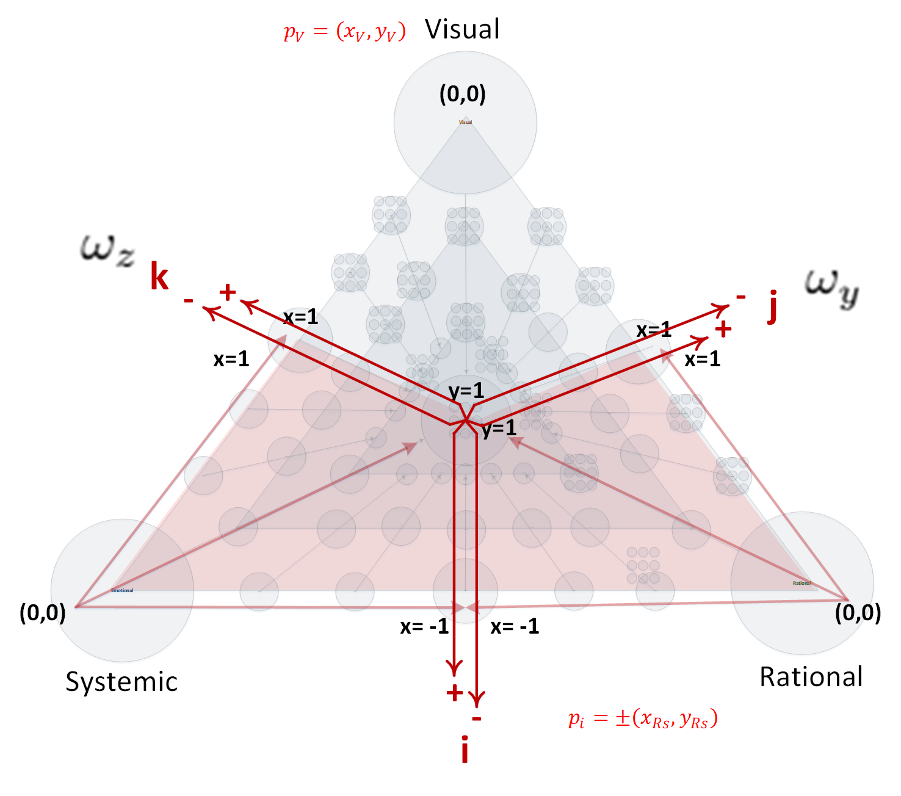
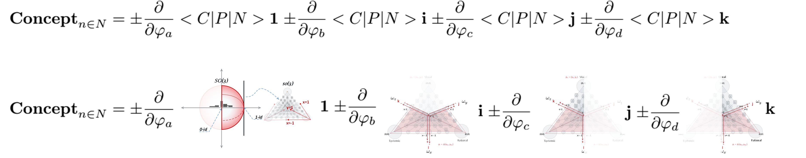
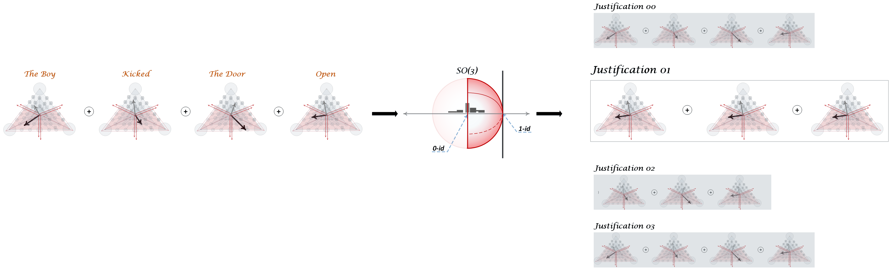
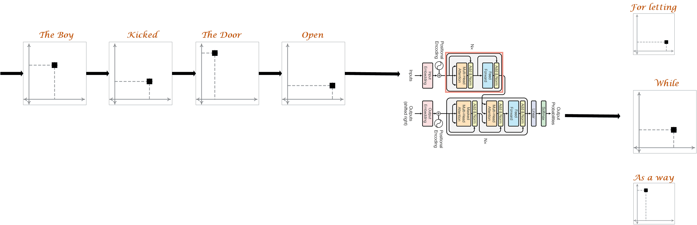

# (AtomConcept)
## An atomic concept for a bottom-up developmental AI approach

 
 
 

### The local Lie-algebraic-like embedding space that explicates the variants of any concept:

### The Dimensions of any concept:

 
 
 

### The reasoning process (space of contradiction-free justifications):

 

### The generative transformers' equivalent top-down model:

